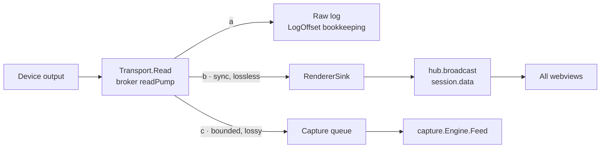
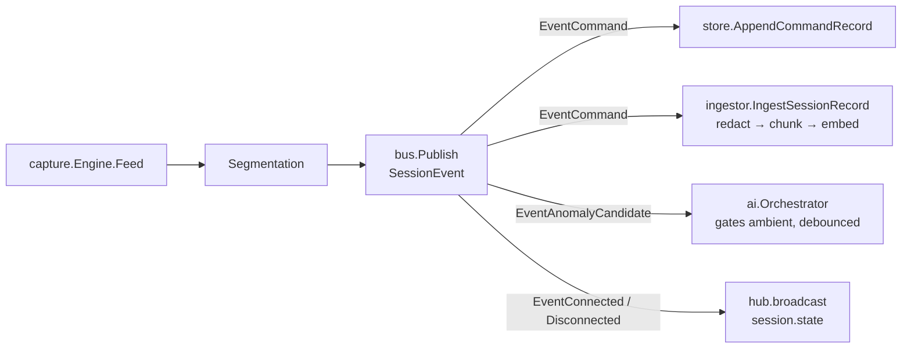

# Concepts and architecture

DRAGON is a three-tier desktop application: a thin desktop shell, a frontend in the OS-native webview, and a Go core daemon. The boundary that matters most is the loopback WebSocket between the frontend and the daemon. Understanding the tee on the hot path and the event bus that carries structured events explains how DRAGON delivers AI in the session path without ever slowing the terminal.

## The three tiers

### Desktop shell

The shell is Tauri v2, written in Rust, and deliberately thin. It opens a window, loads the frontend in the OS-native webview (WebView2 on Windows, WKWebView on macOS, WebKitGTK on Linux), spawns and supervises `dragond` as a bundled sidecar, and provides OS glue including the updater. It is not the backend.

The shell spawns the daemon with `-exit-with-parent`. The daemon runs a goroutine reading the shell's held stdin pipe; if the shell crashes and skips the normal kill, the read returns and the daemon shuts itself down rather than orphaning the process and pinning its sockets.

The shell is also the source of connection authentication: on every launch it generates a fresh `256`-bit token from the OS CSPRNG, passes it to the daemon in the `DRAGON_WS_TOKEN` environment variable — never on the command line — and exposes it to its own webview over Tauri IPC.

### Frontend

The frontend is TypeScript, React, and xterm.js. It renders the tab strip and terminal grid, copilot panel and inline ask bar, staging strip, session tree, settings page, host-key prompts, audit pane, and license pill. State lives in a Zustand store. A one-function transport indirection keeps the store decoupled from the live WebSocket client, so tests inject a mock.

The frontend can also run shell-free against a bare `dragond` and a Vite dev server. The WebSocket boundary makes the shell optional for development.

### Go core

The daemon `dragond` is a single static CGO-free binary. A composition root wires every subsystem; a WebSocket hub dispatches frames to per-message handlers. The core hosts the broker, capture, redact, contextasm, ai, and rag subsystems, plus the event bus, SQLite store, audit log, license verifier, keychain wrapper, and embedded profiles and prompts.

## The loopback contract

The entire frontend-to-core contract is one JSON protocol on `ws://127.0.0.1:7717/ws`. Every frame is a JSON envelope of `{ type, payload }`. The protocol defines client-to-server message types — session control, copilot, suggestions, RAG, audit, serial, settings, saved sessions, Vault, import, license, and host-key and auth answers — and server-to-client types including `session.data`, `session.state`, `copilot.insight`, `copilot.suggestion`, `copilot.answer`, `audit.append`, and `error`.

The wire uses camelCase; the cross-package Go types use snake_case. The translation lives in exactly one file. Expensive dials and inference run in their own goroutines so the read loop stays responsive.

### Connection hardening

The daemon binds loopback only and is not routable. Because loopback binding alone does not stop a malicious web page via DNS rebinding, the daemon adds layered defenses:

- A loopback-literal `Host` header check before the WebSocket upgrade — the primary DNS-rebinding defense.
- A per-launch connection token, carried as a `dragon-token.<token>` WebSocket subprotocol so it never lands in a URL, log, or shell history, and compared in constant time. The shell generates it fresh every launch; when no token is configured — the dev and browser-demo flow — the `Host` and `Origin` checks remain the gate.
- An `Origin` allow-list: absent origins (native webviews send none), loopback hosts, `tauri://`, `wails://`, `file://`, and `*.localhost` hosts pass.
- Per-connection rate limiting on the expensive operations: `session.open`, `copilot.ask`, and `rag.addSource`.
- A concurrent session cap, default `64`, since each live session pins a transport.

> Migrating loopback TCP to an OS pipe remains a tracked hardening item; the per-launch token mitigates but does not remove it.

### Reconnect behavior

If the connection to the local core drops, the frontend reconnects with capped exponential backoff and keeps the real state on screen — sessions, audit log, and license status — behind a "reconnecting…" indicator. It never falls back to sample data once a daemon has been reached. The copilot ask bar is paused until the core returns, and pending auto-analyze turns are disarmed rather than fired blind.

## The hot-path tee

The governing invariant: the render path is never blocked by capture, redaction, or inference. The broker's read pump enforces it. Each chunk of device output goes to an optional raw log, then to the renderer sink synchronously and losslessly, then to the capture queue non-blocking and lossy.

Path (b) never waits on path (c). Under pressure the capture queue drops its oldest chunks and counts the drops; the terminal keeps rendering at native latency. AI failures never take down a live session.

## The event bus

The capture engine emits structured `SessionEvent` records onto an in-process event bus. Consumers — the inference orchestrator, the store persister, and the frontend bridge — subscribe to a session or to all sessions.

Delivery is best-effort and non-blocking toward publishers, the same invariant as the tee. Each subscriber has a bounded buffer (`256` events); a slow consumer has its oldest event dropped rather than stalling the publisher. Drops are counted per-subscriber and bus-wide and logged, never silent — a dropped event could be a security anomaly.

## Data flow end to end

The analysis path is asynchronous and best-effort. A command record flows from capture onto the bus, where the store persists it and the RAG ingestor absorbs it post-redaction. Anomaly-candidate events gate ambient analysis. The orchestrator assembles context, redacts every piece, calls the model, parses the response, guards the command classification, and broadcasts insights and suggestions, recording each step to the audit log.

## Storage model

Everything lives under a single user-data directory, created with `0o700` permissions. There are no services to manage and the directory is trivially backed up.

- `dragon.db` — the SQLite application store: sessions, command records, suggestions, insights, settings, the saved-session tree, Vault credential metadata, and license and trial state.
- `audit/audit-YYYY-MM-DD.jsonl` — the hash-chained audit log, continuous across daily files. An operator can redirect it to a custom or WORM volume; see [redaction and audit](subsystems/redaction-and-audit).
- `rag/chromem/` — the persistent vector store.
- `logs/{session}-{ts}.raw.log` — per-session rotating raw byte logs.
- `known_hosts` — TOFU SSH host keys in OpenSSH format.
- The OS keychain — all secrets, including Vault credentials and the AI API key, referenced from the store by opaque ref only. Never on disk.

## Design invariants

These hold across the product:

- The render path is never blocked by capture, redaction, or inference.
- Suggested commands are never auto-transmitted; acceptance only stages a command in the input line. Auto-analyze reads output; it never sends.
- No secrets reach the SQLite store, the audit log, or any DRAGON file — only opaque keychain references and post-redaction payloads.
- Redaction runs before any text is embedded and again before any model call.
- Dropped internal events are counted and logged, never silent.
- All AI activity — manual, ambient, and auto-analyze — honors the license gate.
